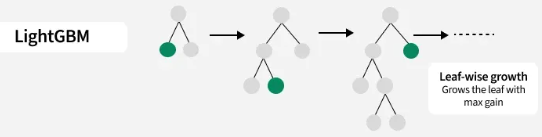

# LightGBM Model for Padma Bridge Toll Traffic Prediction

This directory contains the implementation of a LightGBM (Light Gradient Boosting Machine) model for predicting toll traffic patterns.

## Model Overview

### LightGBM Model
LightGBM is like a team of tiny decision trees that learn from each other’s mistakes. Each tree makes a prediction, the next tree looks at where it went wrong, and tries to fix those errors. By repeating this process, the model gradually improves its predictions. LightGBM is smart and fast because it grows the tree leaves that reduce errors the most, handles missing data naturally, and bins values to speed up calculations, making it especially good for large datasets.

## Data Preparation

1. **Data Loading and Cleaning:**
	- Load daily toll traffic data
	- Convert date formats and sort chronologically
	- Aggregate multiple daily entries
	- Handle missing values and convert monetary columns to numeric

2. **Feature Engineering:**
	- Extract time-based features (year, month, day, weekday, holiday flags)
	- Encode cyclical features using sine/cosine transforms
	- Create lag features (1, 7, 14, 30 days) for each target variable
	- Compute rolling statistics (mean, std, min, max, exponential weighted mean)

## Model Implementation

1. **Data Split:**
	- **Training set:** All data except the most recent fold
	- **Test set:** Most recent fold for validation (using TimeSeriesSplit)

2. **Model Training:**
	- Hyperparameter tuning with GridSearchCV
	- Separate LightGBM models trained for each target variable
	- Standardization of features using StandardScaler

3. **Forecasting:**
	- Short-term predictions for test set evaluation
	- Long-term (365 days) future forecasts using recursive prediction and feature updates

## Results

The model is trained on multiple target variables:
- Traffic_Mawa
- Traffic_Jajira
- Cash_Mawa
- Cash_Jajira
- Total_Cash
- Total_Traffic

Performance metrics (MAE, MSE, RMSE, MAPE, R²) are calculated for each target variable. The LightGBM model demonstrates:
- Effective capture of daily, weekly, and holiday patterns
- Fast training and prediction times

## Model Performance Results

| Target          | Best Params                                                                                                         | MAE          | MSE             | RMSE       | MAPE (%) | R²    |
|-----------------|--------------------------------------------------------------------------------------------------------------------|-------------|----------------|-----------|----------|-------|
| Traffic_Mawa    | {'bagging_fraction': 0.8, 'bagging_freq': 3, 'feature_fraction': 0.8, 'learning_rate': 0.05, 'min_child_samples': 20, 'n_estimators': 300, 'num_leaves': 31} | 1129.76     | 4478299.00     | 2116.20   | 10.63    | 0.645 |
| Traffic_Jajira  | {'bagging_fraction': 0.8, 'bagging_freq': 3, 'feature_fraction': 0.8, 'learning_rate': 0.05, 'min_child_samples': 20, 'n_estimators': 300, 'num_leaves': 31} | 1253.57     | 4837959.00     | 2199.54   | 11.55    | 0.501 |
| Cash_Mawa       | {'bagging_fraction': 0.8, 'bagging_freq': 3, 'feature_fraction': 0.9, 'learning_rate': 0.05, 'min_child_samples': 20, 'n_estimators': 300, 'num_leaves': 31} | 942365.52   | 3057141000000.00 | 1748468.24 | 7.39     | 0.615 |
| Cash_Jajira     | {'bagging_fraction': 0.8, 'bagging_freq': 3, 'feature_fraction': 0.8, 'learning_rate': 0.05, 'min_child_samples': 20, 'n_estimators': 300, 'num_leaves': 31} | 1201711.24  | 4035604000000.00 | 2008881.40 | 9.84     | 0.322 |
| Total_Cash      | {'bagging_fraction': 0.8, 'bagging_freq': 3, 'feature_fraction': 0.8, 'learning_rate': 0.05, 'min_child_samples': 20, 'n_estimators': 300, 'num_leaves': 31} | 1646874.89  | 7922760000000.00 | 2814739.77 | 6.52     | 0.687 |
| Total_Traffic   | {'bagging_fraction': 0.8, 'bagging_freq': 3, 'feature_fraction': 0.8, 'learning_rate': 0.1, 'min_child_samples': 20, 'n_estimators': 300, 'num_leaves': 31} | 1938.85     | 10795320.00    | 3285.62   | 8.91     | 0.671 |

## Key Findings
- LightGBM models outperform classical statistical models in capturing non-linear and complex patterns
- Feature engineering (lags, rolling stats, holidays) significantly boosts predictive accuracy
- R² values are positive, indicating the model explains variance better than mean prediction