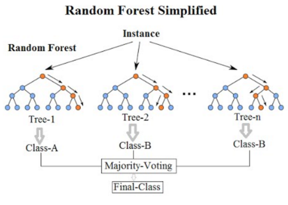

# Random Forest Model for Padma Bridge Toll Traffic Prediction

This notebook demonstrates a complete workflow for predicting Padma Bridge toll traffic using a Random Forest model. It covers data loading, cleaning, feature engineering, model training, evaluation, and forecasting.

## 1. Import Libraries
Essential libraries for data manipulation, visualization, feature engineering, and modeling are imported, including pandas, numpy, matplotlib, seaborn, scikit-learn, and holidays.

## 2. Data Preparation
- Load daily toll traffic data
- Convert date formats and sort chronologically
- Aggregate multiple daily entries
- Handle missing values and convert monetary columns to numeric

## 3. Feature Engineering
- Extract time-based features (year, month, day, weekday, holiday flags)
- Encode cyclical features using sine/cosine transforms
- Create lag features (1, 7, 14, 30 days) for each target variable
- Compute rolling statistics (mean, std, min, max, exponential weighted mean)

## 4. Exploratory Data Analysis (EDA)
- Visualize traffic and cash trends
- Analyze correlations between variables
- Explore distributions of weekends and holidays

## 5. Model Training
- Split data into training and test sets using TimeSeriesSplit
- Standardize features with StandardScaler
- Use MultiOutputRegressor to allow Random Forest to predict multiple targets simultaneously
- Hyperparameter tuning with GridSearchCV

## 6. Model Evaluation
- Predict on the test set
- Calculate performance metrics: MAE, MSE, RMSE, MAPE, R² for each target variable
- Analyze feature importances
- Visualize actual vs predicted values
- Perform residual analysis

## 7. Forecasting
- Generate future dates and features
- Recursively predict 365 days into the future
- Visualize forecasts for each target variable
- Summarize forecast statistics and compare weekend vs weekday averages

## Model Performance Metrics (on test data)

| Target         | MSE            | RMSE           | MAE           | MAPE (%) | R²    |
|---------------|----------------|----------------|---------------|----------|-------|
| **Total_Cash**| **9,638,497,000,000** | **3,104,593**    | **1,849,335**     | **7.01**     | **0.620** |
| Traffic_Mawa  | 5,557,513      | 2,357.44       | 1,268.61      | 11.28    | 0.559 |
| Traffic_Jajira| 5,545,436      | 2,354.88       | 1,268.09      | 11.27    | 0.428 |
| Cash_Mawa     | 3,305,410,000,000 | 1,818,079    | 1,037,359     | 7.71     | 0.584 |
| Cash_Jajira   | 2,876,335,000,000 | 1,695,976    | 1,022,642     | 7.90     | 0.517 |
| Total_Traffic | 16,026,590     | 4,003.32       | 2,306.42      | 10.15    | 0.511 |

## Key Findings
- Random Forest models outperform classical statistical models in capturing non-linear and complex patterns
- R² values are positive, indicating the model explains variance better than mean prediction