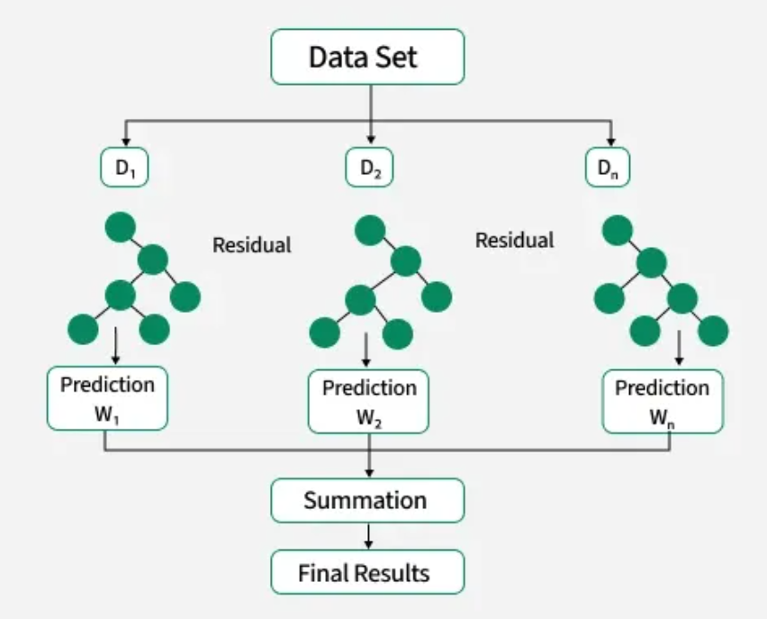

# Padma Bridge Toll Prediction: XGBoost Model Notebook Explained

## What Is Xgboost?

XGBoost stands for Extreme Gradient Boosting, and it’s a highly optimized version of gradient boosted decision trees.

At its core, it builds an ensemble of decision trees in sequence. Each new tree doesn’t try to predict the target directly, it tries to predict the residuals (the errors left over from all the trees before it).

---

## How Does This Notebook Work?

The notebook follows these main steps:

### 1. **Getting the Data Ready**

- Loads the bridge traffic and toll data.
- **Cleans the data**: fixes dates, numbers, and fills in missing information.

### 2. **Adding Additional Information**

- **Mark weekends and holidays**: Since traffic is different on these days, we add a separate boolean column that marks whether the day is Friday/Saturday, or a Holiday (Martyr's Day, Independence Day, 5th August etc.)
- **Breaks down each date** into year, month, day, weekday, etc.
- **Creates special features** so the computer can spot patterns, like "is it a holiday?", "is it a weekend?", "what month is it?".

### 3. **Learning From the Past**

- **Looks at previous days** like yesterday, last week, last month to help predict tomorrow.
- **Calculates averages and trends** from past days, so the model knows if traffic is rising or falling.

### 4. **Training the Prediction Model**

- Uses **XGBoost** to learn from the data.
- **Splits the data** into "training" (to learn) and "testing" (to check if it works).
- **Tries different settings** to find the best prediction model using GridSearchCV.

### 5. **Making Predictions**

- Tests the model with test data to see how well it predicts real traffic and tolls.
- Explains which factors are most important for predictions.

### 6. **Forecasting the Future**

- **Predicts traffic and tolls for the next year** (365 days).
- Shows forecasts for weekdays, weekends, and holidays.

---

## Results Summary

## Performance Metrics (on test data):

| Target           | MSE           | RMSE        | MAE         | MAPE (%) | R²     |
|-----------------|---------------|------------|------------|----------|--------|
| Traffic_Mawa    | 6,057,515     | 2,461.20   | 1,213.40   | 10.28    | 0.5194 |
| Traffic_Jajira  | 5,509,543     | 2,347.24   | 1,228.86   | 10.62    | 0.4320 |
| **Cash_Mawa**       | **3,298,586,000,000** | **1,816,201** | **989,985.70** | **7.14**     | **0.5845** |
| Cash_Jajira     | 2,811,202,000,000 | 1,676,664 | 984,469.30 | 7.32     | 0.5280 |
| Total_Cash      | 10,694,210,000,000 | 3,270,200 | 1,850,165  | 6.74     | 0.5781 |
| Total_Traffic   | 17,732,000    | 4,210.94   | 2,277.12   | 9.56     | 0.4589 |

## Summary
Cash_Mawa achieves the highest R² (0.5845) with a relatively low MAPE (~7%), showing that the model predicts cash flows there better than others. 

Traffic predictions are weaker. Overall, the models capture general trends reasonably well, especially for cash flows, but performance on traffic data shows room for improvement.